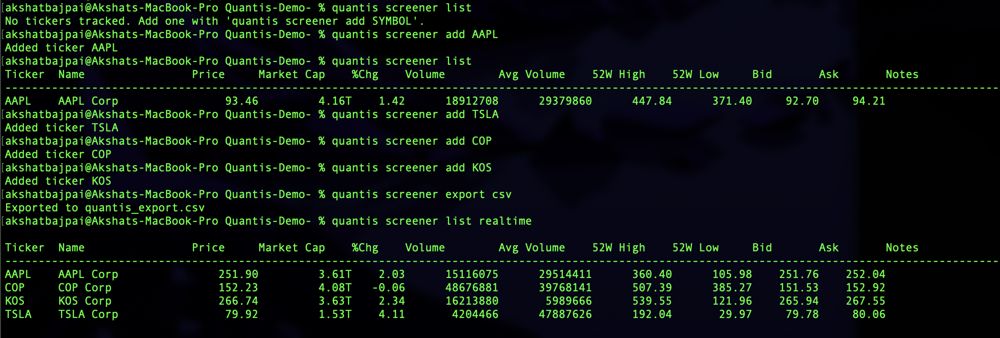

# Quantis

Quantis is a C++20 command-line stock screener that tracks tickers in a local SQLite database and renders fresh quotes on demand or in realtime.

## Features
- SQLite-backed persistence for tracked tickers with metadata (name, sector, industry, notes, date added).
- Screener commands: `list`, `list realtime`, `add SYMBOL`, `remove SYMBOL`, and `export csv`.
- ANSI-rendered table view that refreshes every second in realtime mode until interrupted with `Ctrl+C`.
- Randomized market data provider placeholder that supplies price, volume, market cap, and other quote fields.

## Build and Installation
1. Ensure dependencies are available: a C++20 compiler (e.g., `g++`), CMake, and SQLite3 development headers.
2. Configure and build from the repository root:
   ```bash
   cmake -S . -B build
   cmake --build build
   ```
3. Optionally install the `quantis` binary system-wide (may require elevated privileges):
   ```bash
   sudo cmake --install build
   ```

## Usage
Invoke the CLI via `quantis` (or `./build/quantis` without installing):
- `quantis screener list` — fetch current data for all tracked tickers and print a table.
- `quantis screener list realtime` — continuously refresh the table every second until `Ctrl+C`.
- `quantis screener add SYMBOL` — add a new ticker if it does not already exist.
- `quantis screener remove SYMBOL` — delete a ticker from storage.
- `quantis screener export csv` — export all tracked tickers and quote data to `quantis_export.csv`.

## Testing
- Build to confirm the project compiles:
  ```bash
  cmake --build build
  ```

## Project Structure
- `src/` — implementation files for the screener engine, storage, market data provider, table renderer, and entry point.
- `include/` — public headers for the main components and shared types.
- `CMakeLists.txt` — build configuration for the `quantis` executable.

## Notes
The market data provider currently returns randomized values; integrate a real data source for production use.

## Demo
### Real-time screener demo


